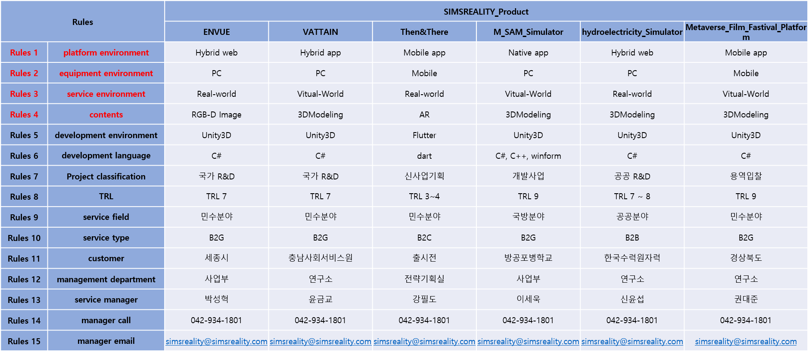

---
categories:
  - CBNU-AI-EX
  - 24년1학기  
tags:
  - Blog
  - CBNU
  - AI
---

# Rule-based System을 활용해 분류기 모델을 만들어 보자(with Durable Rules)

## 개요
Rule-based System을 통해 규칙 모델을 학습하기 위해 내가 근무하는 회사의 제품군들에 대해 분류 규칙을 적용하여 추후 타 업체와의 미팅 시 관련 제품군과 개발 환경 등에 대한 정보들을 빠르게 찾을수 있는 환경을 만들어 보면 좋겠다는 생각에 겸사 겸사 학습을 진행해보았음

### 학습 프로세스 및 목표
- 자사의 6종 제품군에 대한 규칙 정의
- Durable Rules를 사용하여 규칙 구현
- 예제 사실을 통해 규칙 기반 시스템 시연

### 제품군
- **ENVUE**
- **VATTAIN**
- **Then&There**
- **M_SAM_Simulator**
- **hydroelectricity_Simulator**
- **Metaverse_Film_Fastival_Platform**

## 규칙 정의
우리 회사의 제품군은 크게 6종으로 분류할수 있으며 다양한 환경, 컨텐츠 유형, 개발 환경 및 언어 등 총 15가지의 규칙을 정의하였음.



### 예제 규칙
Rule-based System의 코드는 아래와 같이 한번 작성을 해보았음.
```python
from durable.lang import *

with ruleset('sims_product'):
    @when_all(c.first << (m.predicate == 'P_environment') & (m.object == 'Hybrid web'),
             (m.predicate == 'E_environment') & (m.object == 'PC'),
             (m.predicate == 'S_environment') & (m.object == 'real world'),
             (m.predicate == 'Content') & (m.object == 'RGB-D Image') & (m.subject == c.first.subject))
    def ENVUE(c):
        c.assert_fact({'subject': c.first.subject, 'predicate': 'is', 'object': 'ENVUE'})
            
    @when_all(c.first << (m.predicate == 'P_environment') & (m.object == 'Hybrid app'),
             (m.predicate == 'E_environment') & (m.object == 'PC'),
             (m.predicate == 'S_environment') & (m.object == 'vitual world'),
             (m.predicate == 'Content') & (m.object == '3D modeling') & (m.subject == c.first.subject))
    def VATTAIN(c):
        c.assert_fact({'subject': c.first.subject, 'predicate': 'is', 'object': 'VATTAIN'})
    
    @when_all(c.first << (m.predicate == 'P_environment') & (m.object == 'Mobile app'),
             (m.predicate == 'E_environment') & (m.object == 'Mobile'),
             (m.predicate == 'S_environment') & (m.object == 'real world'),
             (m.predicate == 'Content') & (m.object == 'AR') & (m.subject == c.first.subject))
    def Then_There(c):
        c.assert_fact({'subject': c.first.subject, 'predicate': 'is', 'object': 'Then&There'})
        
    @when_all(c.first << (m.predicate == 'P_environment') & (m.object == 'Native app'),
             (m.predicate == 'E_environment') & (m.object == 'PC'),
             (m.predicate == 'S_environment') & (m.object == 'vitual world'),
             (m.predicate == 'Content') & (m.object == '3D modeling') & (m.subject == c.first.subject))
    def M_SAM_Simulator(c):
        c.assert_fact({'subject': c.first.subject, 'predicate': 'is', 'object': 'M_SAM_Simulator'})
        
    @when_all(c.first << (m.predicate == 'P_environment') & (m.object == 'Hybrid web'),
             (m.predicate == 'E_environment') & (m.object == 'PC'),
             (m.predicate == 'S_environment') & (m.object == 'real world'),
             (m.predicate == 'Content') & (m.object == '3D modeling') & (m.subject == c.first.subject))
    def hydroelectricity_Simulator(c):
        c.assert_fact({'subject': c.first.subject, 'predicate': 'is', 'object': 'hydroelectricity_Simulator'})
        

    @when_all(c.first << (m.predicate == 'P_environment') & (m.object == 'Mobile app'),
              (m.predicate == 'E_environment') & (m.object == 'Mobile'),
              (m.predicate == 'S_environment') & (m.object == 'vitual world'),
              (m.predicate == 'Content') & (m.object == '3D modeling') & (m.subject == c.first.subject))
    def Metaverse_Film_Fastival_Platform(c):
        c.assert_fact({'subject': c.first.subject, 'predicate': 'is', 'object': 'Metaverse_Film_Fastival_Platform'})

    @when_all((m.predicate == 'is') & (m.object == 'ENVUE'))
    def ENVUE_More_informaiton(c):
        c.assert_fact({'subject': c.m.subject, 'predicate': 'is', 'object': 'development environment : Unity3D'})
        c.assert_fact({'subject': c.m.subject, 'predicate': 'is', 'object': 'development language : C#'})
        c.assert_fact({'subject': c.m.subject, 'predicate': 'is', 'object': 'Project classification : 국가 R&D'})
        c.assert_fact({'subject': c.m.subject, 'predicate': 'is', 'object': 'TRL : TRL 7'})
        c.assert_fact({'subject': c.m.subject, 'predicate': 'is', 'object': 'service field : 민수분야'})
        c.assert_fact({'subject': c.m.subject, 'predicate': 'is', 'object': 'service type : B2G'})
        c.assert_fact({'subject': c.m.subject, 'predicate': 'is', 'object': 'customer : 세종시'})
        c.assert_fact({'subject': c.m.subject, 'predicate': 'is', 'object': 'management department : 사업부'})
        c.assert_fact({'subject': c.m.subject, 'predicate': 'is', 'object': 'service manager : 박성혁'})
        c.assert_fact({'subject': c.m.subject, 'predicate': 'is', 'object': 'manager call : 042-934-1801'})
        c.assert_fact({'subject': c.m.subject, 'predicate': 'is', 'object': 'manager email : simsreality@simsreality.com'})
    
    @when_all((m.predicate == 'is') & (m.object == 'VATTAIN'))
    def VATTAIN_More_informaiton(c):
        c.assert_fact({'subject': c.m.subject, 'predicate': 'is', 'object': 'development environment : Unity3D'})
        c.assert_fact({'subject': c.m.subject, 'predicate': 'is', 'object': 'development language : C#'})
        c.assert_fact({'subject': c.m.subject, 'predicate': 'is', 'object': 'Project classification : 국가 R&D'})
        c.assert_fact({'subject': c.m.subject, 'predicate': 'is', 'object': 'TRL : TRL 7'})
        c.assert_fact({'subject': c.m.subject, 'predicate': 'is', 'object': 'service field : 민수분야'})
        c.assert_fact({'subject': c.m.subject, 'predicate': 'is', 'object': 'service type : B2G'})
        c.assert_fact({'subject': c.m.subject, 'predicate': 'is', 'object': 'customer : 충남사회서비스원'})
        c.assert_fact({'subject': c.m.subject, 'predicate': 'is', 'object': 'management department : 연구소'})
        c.assert_fact({'subject': c.m.subject, 'predicate': 'is', 'object': 'service manager : 윤금교'})
        c.assert_fact({'subject': c.m.subject, 'predicate': 'is', 'object': 'manager call : 042-934-1801'})
        c.assert_fact({'subject': c.m.subject, 'predicate': 'is', 'object': 'manager email : simsreality@simsreality.com'})
    
    @when_all((m.predicate == 'is') & (m.object == 'Then&There'))
    def ThenThere_More_informaiton(c):
        c.assert_fact({'subject': c.m.subject, 'predicate': 'is', 'object': 'development environment : Flutter'})
        c.assert_fact({'subject': c.m.subject, 'predicate': 'is', 'object': 'development language : dart'})
        c.assert_fact({'subject': c.m.subject, 'predicate': 'is', 'object': 'Project classification : 신사업기획'})
        c.assert_fact({'subject': c.m.subject, 'predicate': 'is', 'object': 'TRL : TRL 3~4'})
        c.assert_fact({'subject': c.m.subject, 'predicate': 'is', 'object': 'service field : 민수분야'})
        c.assert_fact({'subject': c.m.subject, 'predicate': 'is', 'object': 'service type : B2C'})
        c.assert_fact({'subject': c.m.subject, 'predicate': 'is', 'object': 'customer : 출시전'})
        c.assert_fact({'subject': c.m.subject, 'predicate': 'is', 'object': 'management department : 전략기획실'})
        c.assert_fact({'subject': c.m.subject, 'predicate': 'is', 'object': 'service manager : 강필도'})
        c.assert_fact({'subject': c.m.subject, 'predicate': 'is', 'object': 'manager call : 042-934-1801'})
        c.assert_fact({'subject': c.m.subject, 'predicate': 'is', 'object': 'manager email : simsreality@simsreality.com'})
    
    @when_all((m.predicate == 'is') & (m.object == 'M_SAM_Simulator'))
    def M_SAM_Simulator_More_informaiton(c):
        c.assert_fact({'subject': c.m.subject, 'predicate': 'is', 'object': 'development environment : Unity3D'})
        c.assert_fact({'subject': c.m.subject, 'predicate': 'is', 'object': 'development language : C#, C++, winform'})
        c.assert_fact({'subject': c.m.subject, 'predicate': 'is', 'object': 'Project classification : 개발사업'})
        c.assert_fact({'subject': c.m.subject, 'predicate': 'is', 'object': 'TRL : TRL 9'})
        c.assert_fact({'subject': c.m.subject, 'predicate': 'is', 'object': 'service field : 국방분야'})
        c.assert_fact({'subject': c.m.subject, 'predicate': 'is', 'object': 'service type : B2G'})
        c.assert_fact({'subject': c.m.subject, 'predicate': 'is', 'object': 'customer : 방공포병학교'})
        c.assert_fact({'subject': c.m.subject, 'predicate': 'is', 'object': 'management department : 사업부'})
        c.assert_fact({'subject': c.m.subject, 'predicate': 'is', 'object': 'service manager : 이세욱'})
        c.assert_fact({'subject': c.m.subject, 'predicate': 'is', 'object': 'manager call : 042-934-1801'})
        c.assert_fact({'subject': c.m.subject, 'predicate': 'is', 'object': 'manager email : simsreality@simsreality.com'})
    
    @when_all((m.predicate == 'is') & (m.object == 'hydroelectricity_Simulator'))
    def hydroelectricity_Simulator_More_informaiton(c):
        c.assert_fact({'subject': c.m.subject, 'predicate': 'is', 'object': 'development environment : Unity3D'})
        c.assert_fact({'subject': c.m.subject, 'predicate': 'is', 'object': 'development language : C#'})
        c.assert_fact({'subject': c.m.subject, 'predicate': 'is', 'object': 'Project classification : 공공 R&D'})
        c.assert_fact({'subject': c.m.subject, 'predicate': 'is', 'object': 'TRL : TRL 7~8'})
        c.assert_fact({'subject': c.m.subject, 'predicate': 'is', 'object': 'service field : 공공분야'})
        c.assert_fact({'subject': c.m.subject, 'predicate': 'is', 'object': 'service type : B2G'})
        c.assert_fact({'subject': c.m.subject, 'predicate': 'is', 'object': 'customer : 한국수력원자력'})
        c.assert_fact({'subject': c.m.subject, 'predicate': 'is', 'object': 'management department : 연구소'})
        c.assert_fact({'subject': c.m.subject, 'predicate': 'is', 'object': 'service manager : 신윤섭'})
        c.assert_fact({'subject': c.m.subject, 'predicate': 'is', 'object': 'manager call : 042-934-1801'})
        c.assert_fact({'subject': c.m.subject, 'predicate': 'is', 'object': 'manager email : simsreality@simsreality.com'})
    
    @when_all((m.predicate == 'is') & (m.object == 'Metaverse_Film_Fastival_Platform'))
    def Metaverse_Film_Fastival_Platform_More_informaiton(c):
        c.assert_fact({'subject': c.m.subject, 'predicate': 'is', 'object': 'development environment : Unity3D'})
        c.assert_fact({'subject': c.m.subject, 'predicate': 'is', 'object': 'development language : C#'})
        c.assert_fact({'subject': c.m.subject, 'predicate': 'is', 'object': 'Project classification : 용역입찰'})
        c.assert_fact({'subject': c.m.subject, 'predicate': 'is', 'object': 'TRL : TRL 9'})
        c.assert_fact({'subject': c.m.subject, 'predicate': 'is', 'object': 'service field : 민수분야'})
        c.assert_fact({'subject': c.m.subject, 'predicate': 'is', 'object': 'service type : B2G'})
        c.assert_fact({'subject': c.m.subject, 'predicate': 'is', 'object': 'customer : 경상북도'})
        c.assert_fact({'subject': c.m.subject, 'predicate': 'is', 'object': 'management department : 연구소'})
        c.assert_fact({'subject': c.m.subject, 'predicate': 'is', 'object': 'service manager : 권대준'})
        c.assert_fact({'subject': c.m.subject, 'predicate': 'is', 'object': 'manager call : 042-934-1801'})
        c.assert_fact({'subject': c.m.subject, 'predicate': 'is', 'object': 'manager email : simsreality@simsreality.com'})
    
            
    @when_all(+m.subject)
    def output(c):
        print('Fact: {0} {1} {2}'.format(c.m.subject, c.m.predicate, c.m.object))
        
        
# ENVUE
assert_fact('sims_product', {'subject': 'ENVUE', 'predicate': 'P_environment', 'object': 'Hybrid web'})
assert_fact('sims_product', {'subject': 'ENVUE', 'predicate': 'E_environment', 'object': 'PC'})
assert_fact('sims_product', {'subject': 'ENVUE', 'predicate': 'S_environment', 'object': 'real world'})
assert_fact('sims_product', {'subject': 'ENVUE', 'predicate': 'Content', 'object': 'RGB-D Image'})
# VATTAIN
assert_fact('sims_product', {'subject': 'VATTAIN', 'predicate': 'P_environment', 'object': 'Hybrid app'})
assert_fact('sims_product', {'subject': 'VATTAIN', 'predicate': 'E_environment', 'object': 'PC'})
assert_fact('sims_product', {'subject': 'VATTAIN', 'predicate': 'S_environment', 'object': 'vitual world'})
assert_fact('sims_product', {'subject': 'VATTAIN', 'predicate': 'Content', 'object': '3D modeling'})

# Then&There
assert_fact('sims_product', {'subject': 'Then&There', 'predicate': 'P_environment', 'object': 'Mobile app'})
assert_fact('sims_product', {'subject': 'Then&There', 'predicate': 'E_environment', 'object': 'Mobile'})
assert_fact('sims_product', {'subject': 'Then&There', 'predicate': 'S_environment', 'object': 'real world'})
assert_fact('sims_product', {'subject': 'Then&There', 'predicate': 'Content', 'object': 'AR'})

# M-SAM
assert_fact('sims_product', {'subject': 'M-SAM', 'predicate': 'P_environment', 'object': 'Native app'})
assert_fact('sims_product', {'subject': 'M-SAM', 'predicate': 'E_environment', 'object': 'PC'})
assert_fact('sims_product', {'subject': 'M-SAM', 'predicate': 'S_environment', 'object': 'vitual world'})
assert_fact('sims_product', {'subject': 'M-SAM', 'predicate': 'Content', 'object': '3D modeling'})

# hydroelectricity_Simulator
assert_fact('sims_product', {'subject': 'hydroelectricity', 'predicate': 'P_environment', 'object': 'Hybrid web'})
assert_fact('sims_product', {'subject': 'hydroelectricity', 'predicate': 'E_environment', 'object': 'PC'})
assert_fact('sims_product', {'subject': 'hydroelectricity', 'predicate': 'S_environment', 'object': 'real world'})
assert_fact('sims_product', {'subject': 'hydroelectricity', 'predicate': 'Content', 'object': '3D modeling'})

# Metaverse_Film_Fastival_Platform
assert_fact('sims_product', {'subject': 'Metaverse_Platform', 'predicate': 'P_environment', 'object': 'Mobile app'})
assert_fact('sims_product', {'subject': 'Metaverse_Platform', 'predicate': 'E_environment', 'object': 'Mobile'})
assert_fact('sims_product', {'subject': 'Metaverse_Platform', 'predicate': 'S_environment', 'object': 'vitual world'})
assert_fact('sims_product', {'subject': 'Metaverse_Platform', 'predicate': 'Content', 'object': '3D modeling'})
```

## 코드 실행 방법
이 프로젝트를 실행하려면 Python과 Durable Rules 라이브러리가 필요하며, Durable Rules는 다음과 같이 설치할 수 있음
```bash
pip install durable-rules
```
라이브러리를 설치한 후, 스크립트를 실행하여 규칙 기반 시스템이 작동하는지 확인할 수 있으며, 스크립트의 `assert_fact` 문은 규칙을 트리거하고 해당 출력을 생성함.

## 개인적인 생각
처음에는 복잡하고 어렵게 느껴졌지만, 실제로 규칙을 정의하고 적용하면서 점차 그 원리를 이해할 수 있었음.  
다양한 조건과 상황에 따라 시스템이 자동으로 결정을 내리는 것을 보면서 인공지능의 강력함과 효율성을 체감할 수 있었으며, 특히, Durable Rules와 같은 도구를 활용하면 복잡한 비즈니스 로직을 보다 체계적으로 관리할 수 있다는 점이 인상적이었음.  
다만 아쉬운 점은  
인공지능 공부를 이번에 처음 진행하면서 가장 기초적이라 할수 있는 Rule-based Model에 대해서 예제를 기반으로 나름 코드를 수정하고 만들어 보았으나 처음이다 보니 Rule-based에 대한 개념이 살짝 부족했던것 같다.  
너무 단순하게 초기 규칙만 맞으면 바로 분류해버리는 구조로 만들어 버려서 추후 조금더 학습을해서 더 많은 규칙과 시나리오를 추가해보면서 이 시스템을 발전시켜 회사 실무에서 사용할수 있을 정도로 수정해봐야겠다.  

