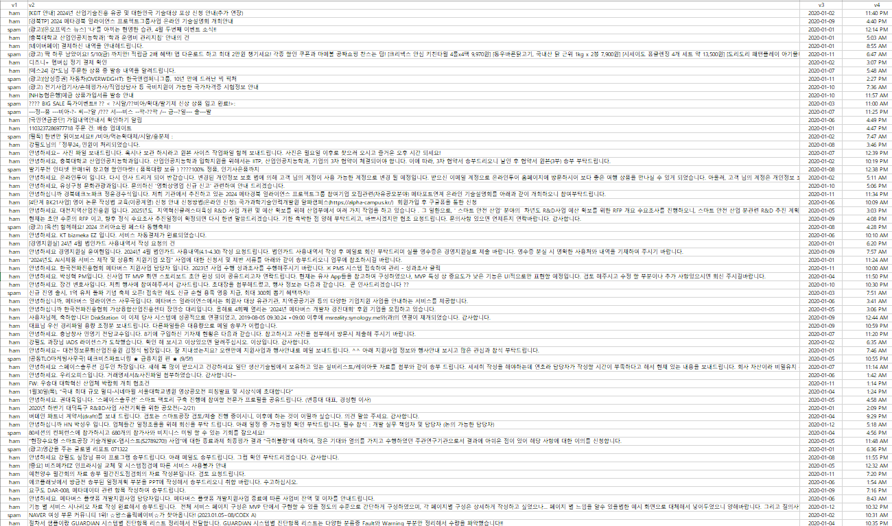
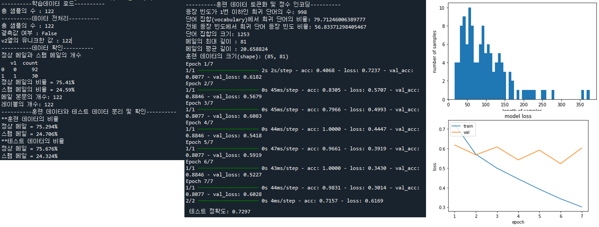

---
categories:
  - CBNU-AI-EX
  - 24년1학기  
tags:
  - Blog
  - CBNU
  - AI
---

# 순환신경망(RNN)을 활용한 한글 스팸 메일 분류 모델 학습 및 검증

## 개요
본격적으로 인공지능을 학습하면서 딥러닝 신경망에 대해서 학습을 하게되었고 이에 순환신경망(RNN)을 활용하여 모델 학습을 해보려고 한다.  
순환신경망 학습의 가장 기초적인 예제는 바로 '스팸 메일 분류'라고 할수 있을것 같다(개인적인 생각)  
하지만 영문 메일에 대한 스팸 분류 모델은 학습이 잘되고 성능도 잘 나오는 반면, 대한민국! 우리의 아름다운 한글은 어순이 유연하고 조사 사용이 많아 문장 구조가 영어보다 복잡해서 학습이 잘 되지 않는것 같아 한번 예시를 만들어 보면서 확인해보려고 한다.

### 목표
- 한글 데이터로 스팸 메일 분류 모델 구현
- RNN 모델을 사용하여 스팸 메일과 정상 메일을 이진 분류

## 데이터 설명
- **데이터 수집**: 사내 메일 및 외부 메일에서 스팸 메일 관련 데이터 수집 (총 122개 샘플)
- **데이터 구성**: 텍스트 형태의 메일 내용과 레이블 (스팸/정상)


## 사용 모델
- **모델**: 순환 신경망(RNN) 모델
- **구현**: 바닐라 RNN (1:1 RNN)

## 학습 과정
### 1. **데이터 파악**
- 한글 스팸 데이터 생성 및 로드
```python
import numpy as np
import pandas as pd
import matplotlib.pyplot as plt
import urllib.request

from sklearn.model_selection import train_test_split
from tensorflow.keras.preprocessing.text import Tokenizer
from tensorflow.keras.preprocessing.sequence import pad_sequences

#----------학습데이터 로드----------
data = pd.read_csv('spam_kr.csv', encoding='euc-kr')
print('총 샘플의 수 :',len(data))
```  
- 총 데이터 수 및 데이터 확인
```python
#----------데이터 확인----------
print('정상 메일과 스팸 메일의 개수')
print(data.groupby('v1').size().reset_index(name='count'))
print(f'정상 메일의 비율 = {round(data["v1"].value_counts()[0]/len(data) * 100,3)}%')
print(f'스팸 메일의 비율 = {round(data["v1"].value_counts()[1]/len(data) * 100,3)}%')
print('메일 본문의 개수: {}'.format(len(X_data)))
print('레이블의 개수: {}'.format(len(y_data)))
```  
### 2. **데이터 전처리**
- 불필요한 컬럼 삭제 및 중복 데이터 제거
```python
del data['v3']
del data['v4']
data['v1'] = data['v1'].replace(['ham','spam'],[0,1])
print('총 샘플의 수 :',len(data))
# data.info()
print('결측값 여부 :',data.isnull().values.any())
print('v2열의 유니크한 값 :',data['v2'].nunique())
data.drop_duplicates(subset=['v2'], inplace=True) #v2열 중복 제거
X_data = data['v2']
y_data = data['v1']
# data['v1'].value_counts().plot(kind='bar')
```
- 학습 데이터와 테스트 데이터 분리
```python
#훈련 데이터와 테스트 데이터 분리
X_train, X_test, y_train, y_test = train_test_split(X_data, y_data, test_size=0.3, random_state=0, stratify=y_data)

print('**훈련 데이터의 비율')
print(f'정상 메일 = {round(y_train.value_counts()[0]/len(y_train) * 100,3)}%')
print(f'스팸 메일 = {round(y_train.value_counts()[1]/len(y_train) * 100,3)}%')

print('**테스트 데이터의 비율')
print(f'정상 메일 = {round(y_test.value_counts()[0]/len(y_test) * 100,3)}%')
print(f'스팸 메일 = {round(y_test.value_counts()[1]/len(y_test) * 100,3)}%')
```
- 토큰화 및 정수 인코딩
```python
#케라스 토크나이저를 통해 훈련 데이터에 대한 토큰화 및 정수 인코딩 
tokenizer = Tokenizer()
tokenizer.fit_on_texts(X_train)
X_train_encoded = tokenizer.texts_to_sequences(X_train)
# print(X_train_encoded[:5])
word_to_index = tokenizer.word_index
print(word_to_index)
```
### 3. **모델 학습 및 평가**
- 바닐라 RNN 모델을 사용하여 학습 및 평가

### Full 코드
```python
import numpy as np
import pandas as pd
import matplotlib.pyplot as plt
import urllib.request

from sklearn.model_selection import train_test_split
from tensorflow.keras.preprocessing.text import Tokenizer
from tensorflow.keras.preprocessing.sequence import pad_sequences

data = pd.read_csv('spam_kr.csv', encoding='euc-kr')
print('총 샘플의 수 :',len(data))

del data['v3']
del data['v4']
data['v1'] = data['v1'].replace(['ham','spam'],[0,1])
print('총 샘플의 수 :',len(data))
# data.info()
print('결측값 여부 :',data.isnull().values.any())
print('v2열의 유니크한 값 :',data['v2'].nunique())
data.drop_duplicates(subset=['v2'], inplace=True) #v2열 중복 제거
X_data = data['v2']
y_data = data['v1']
# data['v1'].value_counts().plot(kind='bar')

print('정상 메일과 스팸 메일의 개수')
print(data.groupby('v1').size().reset_index(name='count'))
print(f'정상 메일의 비율 = {round(data["v1"].value_counts()[0]/len(data) * 100,3)}%')
print(f'스팸 메일의 비율 = {round(data["v1"].value_counts()[1]/len(data) * 100,3)}%')
print('메일 본문의 개수: {}'.format(len(X_data)))
print('레이블의 개수: {}'.format(len(y_data)))

#훈련 데이터와 테스트 데이터 분리
X_train, X_test, y_train, y_test = train_test_split(X_data, y_data, test_size=0.3, random_state=0, stratify=y_data)

print('**훈련 데이터의 비율')
print(f'정상 메일 = {round(y_train.value_counts()[0]/len(y_train) * 100,3)}%')
print(f'스팸 메일 = {round(y_train.value_counts()[1]/len(y_train) * 100,3)}%')

print('**테스트 데이터의 비율')
print(f'정상 메일 = {round(y_test.value_counts()[0]/len(y_test) * 100,3)}%')
print(f'스팸 메일 = {round(y_test.value_counts()[1]/len(y_test) * 100,3)}%')

#케라스 토크나이저를 통해 훈련 데이터에 대한 토큰화 및 정수 인코딩 
tokenizer = Tokenizer()
tokenizer.fit_on_texts(X_train)
X_train_encoded = tokenizer.texts_to_sequences(X_train)
# print(X_train_encoded[:5])
word_to_index = tokenizer.word_index
print(word_to_index)

threshold = 2
total_cnt = len(word_to_index) # 단어의 수
rare_cnt = 0 # 등장 빈도수가 threshold보다 작은 단어의 개수를 카운트
total_freq = 0 # 훈련 데이터의 전체 단어 빈도수 총 합
rare_freq = 0 # 등장 빈도수가 threshold보다 작은 단어의 등장 빈도수의 총 합

# 단어와 빈도수의 쌍(pair)을 key와 value로 받는다.
for key, value in tokenizer.word_counts.items():
    total_freq = total_freq + value

    # 단어의 등장 빈도수가 threshold보다 작으면
    if(value < threshold):
        rare_cnt = rare_cnt + 1
        rare_freq = rare_freq + value

print('등장 빈도가 %s번 이하인 희귀 단어의 수: %s'%(threshold - 1, rare_cnt))
print("단어 집합(vocabulary)에서 희귀 단어의 비율:", (rare_cnt / total_cnt)*100)
print("전체 등장 빈도에서 희귀 단어 등장 빈도 비율:", (rare_freq / total_freq)*100)

vocab_size = len(word_to_index) + 1
print('단어 집합의 크기: {}'.format((vocab_size)))

print('메일의 최대 길이 : %d' % max(len(sample) for sample in X_train_encoded))
print('메일의 평균 길이 : %f' % (sum(map(len, X_train_encoded))/len(X_train_encoded)))
plt.hist([len(sample) for sample in X_data], bins=50)
plt.xlabel('length of samples')
plt.ylabel('number of samples')
plt.show()

max_len = 81
X_train_padded = pad_sequences(X_train_encoded, maxlen = max_len)
print("훈련 데이터의 크기(shape):", X_train_padded.shape)

# RNN(Recurrent Neural Network, 순환신경망) 모델로 스팸 메일 분류하기 학습
from tensorflow.keras.layers import SimpleRNN, Embedding, Dense
from tensorflow.keras.models import Sequential

embedding_dim = 32
hidden_units = 32

model = Sequential()
model.add(Embedding(vocab_size, embedding_dim))
model.add(SimpleRNN(hidden_units))
model.add(Dense(1, activation='sigmoid'))

model.compile(optimizer='rmsprop', loss='binary_crossentropy', metrics=['acc'])
history = model.fit(X_train_padded, y_train, epochs=4, batch_size=64, validation_split=0.3)

X_test_encoded = tokenizer.texts_to_sequences(X_test)
X_test_padded = pad_sequences(X_test_encoded, maxlen = max_len)
print("\n 테스트 정확도: %.4f" % (model.evaluate(X_test_padded, y_test)[1]))

epochs = range(1, len(history.history['acc']) + 1)
plt.plot(epochs, history.history['loss'])
plt.plot(epochs, history.history['val_loss'])
plt.title('model loss')
plt.ylabel('loss')
plt.xlabel('epoch')
plt.legend(['train', 'val'], loc='upper left')
plt.show()
```
## 성능
총 샘플 수: 122  
정확도: 0.7297


## 느낀 점
한글로 된 스팸 데이터를 활용하면 학습의 성능이 좋지 않을것이라는 것을 알고 시작했으나, 역시나 좋은 학습이 이루어 지지는 않았음.  
하지만 이번 학습을 통해 데이터 전처리의 중요성에 대해서 한번더 생각하게 되었음.  
그런데, 데이터의 양이 적어서 그런것일수도 있을까? 다음에 한글 스팸 데이터의 양과 질(다양한 문장들)을 다량으로 수집하여 한번더 시도해봐야겠다.
